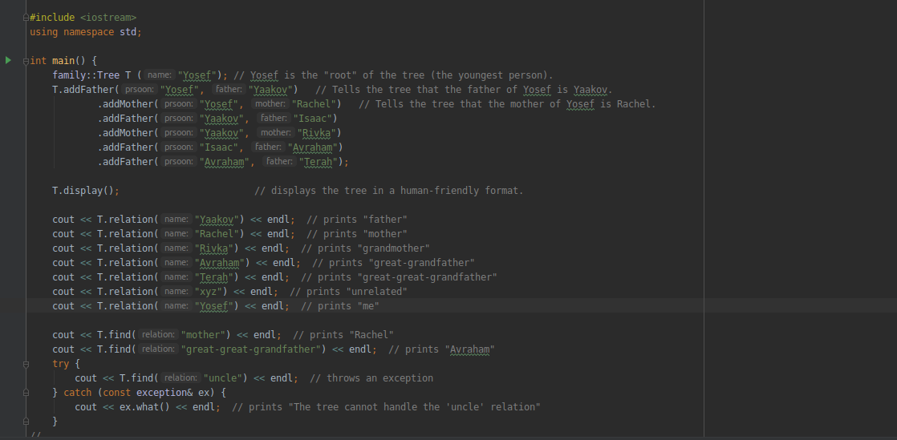

# FamilyTree
This  project is The second assintment of C++ course in ariel univecity 
  
 
 Main features : 
  -  
  - add a Family tree member to a Tree 
  - find a family member by relation as a string .
  - find a relation of a family member 
  - show the whole tree to the console as a text in post order.

 

  
### Installation


Pull the file from the Git repository with the command : 
```sh
$ git clone https://github.com/simon-pikalov/cpp_2_B.git

```

# Photo



